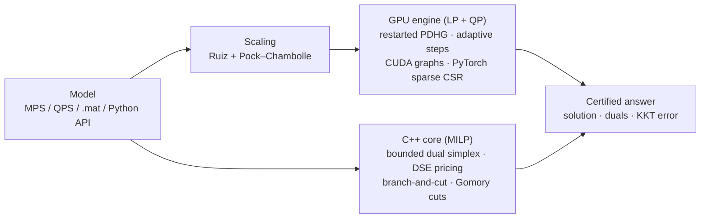

# SAMADHAN — a sovereign optimization solver (LP · QP · MILP), GPU-first

[](https://github.com/NAMAN-THAKUR-1944/SIH2026-SIH26119-SAMADHAN/actions/workflows/tests.yml)
[](LICENSE)


**Smart India Hackathon 2026 · PS SIH26119 (MRPL): *Indigenous GPU-Accelerated Optimization Solver
(Sovereign Alternative to Xpress / CPLEX)* · Team VIGHNAX (127364)**

SAMADHAN (समाधान, "solution") is an optimization solver written from scratch: no CPLEX, Gurobi, Xpress,
HiGHS, CBC or SCIP code inside. It has two engines:

* a **GPU engine for LP and convex QP**: restarted primal-dual hybrid gradient (PDLP / PDQP family), running
  entirely on the GPU with sparse mat-vecs and CUDA graphs;
* a **C++17 core for MILP**: bounded dual simplex and branch-and-cut (warm-started nodes, pseudocost
  branching, Gomory mixed-integer cuts).

HiGHS, the leading open-source solver, is used only as an outside referee for answers and speed.

▶ **3-minute demo video:** [youtu.be/zagX0zqtIeU](https://youtu.be/zagX0zqtIeU) (a real 1.16 M-variable run, the head-to-head with HiGHS, and all benchmark results)

📄 **Idea deck:** [`docs/SAMADHAN_SIH26119_Idea.pdf`](docs/SAMADHAN_SIH26119_Idea.pdf)

🧪 **Check it yourself in 5 minutes:** [two Docker commands](#evaluate-it-in-5-minutes), nothing else to install

[](https://youtu.be/zagX0zqtIeU)

## Results at a glance

All numbers are measured on one laptop (RTX 5050 Laptop GPU 8 GB), are reproducible with the scripts
below, and are stored in [`results/`](results).

| | What | Result |
|---|---|---|
| **LP** | Refinery planning LP, 1.16 M variables | **5.1× faster** than HiGHS at 1e-6 (cost within 0.0002 %), **22×** at 1e-4 |
| **LP** | Netlib (91 models) | 86 solved to 1e-4 relative KKT; MPS reader identical to HiGHS on 91/91 |
| **MILP** | MIPLIB 3 (58 models ≤ 1,500 rows, 60 s) | **26 proved optimal**, all correct; 3 of them HiGHS could not finish (nw04, pk1, mas76); HiGHS proves 46 |
| **QP** | Maros–Meszaros (129 convex QPs, 60 s) | **79 solved** to 1e-6 relative KKT (HiGHS 99); all 64 solved by both agree; 15 only SAMADHAN solves |
| **QP** | Refinery QP (convex cost curves) | 13k vars: 78× faster than the HiGHS QP solver; from 110k vars HiGHS does not finish in 600 s, SAMADHAN takes 1.5 s |


## Evaluate it in 5 minutes

Only Docker is needed: no Python, CUDA or compiler. Build the image straight from this repository, then run it:

```bash
docker build -t samadhan https://github.com/NAMAN-THAKUR-1944/SIH2026-SIH26119-SAMADHAN.git
docker run --rm samadhan
```

The build takes a few minutes (it downloads PyTorch and compiles the C++ core). The run is a self-check of
both engines: small LP, QP and MILP models are solved, every answer is compared with HiGHS or with an optimum
worked out by hand, and feasibility is recomputed from the returned solution vector instead of trusting the
solver's own report. Real output on a laptop CPU:

```text
SAMADHAN self-check   GPU engine on CPU (no CUDA GPU found)   referee: HiGHS 1.15.1

     model                      vars  engine             SAMADHAN      reference            obj. err  infeas.    time
---------------------------------------------------------------------------------------------------------------------
LP   textbook (2 vars)             2  GPU engine              -36            -36  by hand    5.6e-10  0.0e+00   0.03s  PASS
LP   textbook (2 vars)             2  C++ core                -36            -36  by hand    0.0e+00  0.0e+00   0.00s  PASS
LP   refinery planning         1,708  GPU engine        87491.691      87491.468  HiGHS      2.6e-06  9.6e-07   1.06s  PASS
LP   refinery planning         1,708  C++ core          87491.468      87491.468  HiGHS      8.3e-16  4.3e-15   0.04s  PASS
QP   HS21, Maros-Meszaros          2  GPU engine           -99.96         -99.96  by hand    0.0e+00  0.0e+00   0.01s  PASS
QP   refinery, convex costs    1,708  GPU engine        113146.25      113146.25  HiGHS      1.9e-08  5.8e-07   0.61s  PASS
MILP textbook knapsack             2  C++ core                -20            -20  by hand    0.0e+00  0.0e+00   0.00s  PASS
MILP refinery contracts #0       146  C++ core           27531.34       27531.34  HiGHS      1.2e-15  1.9e-14   0.02s  PASS
MILP refinery contracts #1       146  C++ core          23781.574      23781.574  HiGHS      3.4e-15  5.4e-13   0.03s  PASS
MILP refinery contracts #2       146  C++ core          44110.416      44110.416  HiGHS      1.6e-16  2.4e-14   0.00s  PASS

10/10 checks passed in 3.0 s.  obj. err = relative distance to the reference;
infeas. = worst constraint, bound or integrality violation, recomputed here from the solution vector.
```

Then try:

| To see | Run |
|---|---|
| Your own model (LP goes to the GPU engine, MILP to the C++ core) | `docker run --rm -v "$PWD:/models" samadhan solve /models/model.mps` |
| A 110k-variable refinery planning LP (about 10 s on a CPU) | `docker run --rm samadhan demo --size M --device cpu` |
| The full test suite | `docker run --rm --entrypoint python samadhan -m pytest -q` |

**On an NVIDIA GPU** (Windows: Docker Desktop with the WSL 2 engine; Linux: the NVIDIA Container Toolkit), build
the CUDA image (it needs about 12 GB of disk) and solve the 1.16 M-variable refinery LP:

```bash
docker build --build-arg TORCH_INDEX=https://download.pytorch.org/whl/cu128 -t samadhan:gpu https://github.com/NAMAN-THAKUR-1944/SIH2026-SIH26119-SAMADHAN.git
docker run --rm --gpus all samadhan:gpu demo --size XL --tol 1e-6
```

On the RTX 5050 laptop this takes 73.7 s inside Docker and 65.5 s natively (the same 1.2 ms per iteration; the
Docker run needed more iterations), against 323 s for HiGHS. `docker run --rm --gpus all samadhan:gpu` runs the
self-check on the GPU, and all 28 tests pass in the GPU image.

In Windows PowerShell write `${PWD}` instead of `$PWD`. Every number in this README has its raw data in
[`results/`](results) and the command that produced it under [Reproduce every number](#reproduce-every-number).

## Architecture



## Results in detail

### LP — refinery supply-chain planning (MRPL use case)

Crude purchase, CDU capacity, sulfur blending, yields, dispatch and depot inventory. HiGHS is credited with
the faster of its dual simplex and interior point; SAMADHAN with the faster of its two GPU methods.

| Model | Variables | Nonzeros | HiGHS (best) | SAMADHAN accurate (1e-6) | SAMADHAN fast (1e-4) |
|---|---:|---:|---:|---:|---:|
| S  | 13,296    | 25,416    | 0.24 s | 2.2 s (0.1×)  | 0.7 s (0.3×) |
| M  | 109,536   | 214,092   | 8.5 s  | 12.6 s (0.7×) | 1.8 s (4.8×) |
| L  | 406,080   | 796,512   | 63.9 s | 30.7 s (2.1×) | 5.3 s (12×) |
| XL | 1,157,120 | 2,273,888 | 323 s  | 63.7 s (5.1×) | 15.0 s (22×) |

**Netlib:** 86/91 solved to 1e-4 relative KKT (CPU mode, median 1.7 s), 80 within 0.1 % of the known optimum.
The 5 unsolved (bnl1, greenbea, greenbeb, perold, pilot4) are ill-conditioned cases for the planned crossover.

### MILP — MIPLIB 3


58 MIPLIB 3 models (7 larger ones skipped: the prototype keeps a dense basis inverse), 60 s each, one thread
each, relative gap 1e-4. **SAMADHAN proves 26 optimal**, every one matching the known optimum;
HiGHS proves 46. SAMADHAN finishes **nw04** (87,482 columns) in 10.6 s, **pk1** and **mas76** where HiGHS runs
out of time, and is faster on air03, mod010, khb05250 and p0033. On the rest HiGHS is far ahead: it has
presolve, many cut families and strong primal heuristics that this prototype does not have yet.

### QP — Maros–Meszaros and refinery QP


The same GPU engine solves convex QPs (`0.5 x'Qx + c'x`) by adding the gradient `Qx` to the primal step.
**Maros–Meszaros** (129 convex QPs, CPU mode, 60 s, one thread each): SAMADHAN solves **79** to 1e-6
relative KKT and the HiGHS QP solver 99. All **64** solved by both agree to 1e-4. SAMADHAN solves **15** that
HiGHS does not (HiGHS reports a solve error, no status or a time-out, e.g. AUG2D, LASER, MOSARQP1, QSCTAP3),
and HiGHS crashes on STADAT1. HiGHS solves 35 that SAMADHAN does not finish in 60 s: ill-conditioned problems
where a first-order method needs many more iterations or a crossover step.

**Refinery QP** (every activity has a convex cost curve: crude supply, processing, freight congestion,
holding and shortage), GPU, 1e-6 relative KKT. HiGHS's QP solver is an active-set method:

| Model | Variables | HiGHS QP | SAMADHAN GPU (1e-6) | Cost check |
|---|---:|---:|---:|---|
| S | 13,296 | 86.3 s | 1.1 s (78×) | 0.00016 % from HiGHS |
| M | 109,536 | > 600 s (not solved) | 1.5 s (> 402×) | certified by KKT (1e-6) |
| L | 406,080 | > 1660 s (not solved) | 5.1 s (> 323×) | certified by KKT (1e-6) |
| XL | 1,157,120 | not attempted ¹ | 19.9 s (—) | certified by KKT (1e-6) |

¹ HiGHS was given 600 s per model; on L it stopped only after 1,660 s without a solution, so XL was not attempted.

## Honest limitations

* Small LPs are faster on HiGHS (CPU simplex); the GPU pays off from roughly 100 k variables.
* First-order methods reach 1e-4…1e-6 relative accuracy, not simplex vertices; crossover is on the roadmap.
* The MILP core has no presolve yet and only Gomory cuts, and uses a dense basis inverse (≤ ~1,500 rows).

## Install without Docker

```bash
python -m venv .venv
.venv/Scripts/pip install torch --index-url https://download.pytorch.org/whl/cu128   # or /whl/cpu
.venv/Scripts/pip install -r requirements.txt
.venv/Scripts/python -m samadhan verify                         # self-check of both engines, ~10 s
.venv/Scripts/python -m pytest                                  # 28 correctness tests, ~20 s
.venv/Scripts/python -m samadhan demo --size XL --tol 1e-6      # 1.16M-variable refinery LP on the GPU
.venv/Scripts/python -m samadhan solve model.mps                # LP -> GPU engine, MILP -> C++ core
.venv/Scripts/python -m samadhan solve model.mps --engine core  # force the C++ dual simplex / branch-and-cut
```

```python
from samadhan import read_mps, solve, solve_core

lp = read_mps("model.mps")
print(solve(lp, device="cuda", tol=1e-6).primal_obj)   # GPU engine: LP, or QP when lp.Q is set
print(solve_core(lp, time_limit=60).obj)               # C++ core: LP or MILP (integer markers in the file)
```

The C++ core is compiled automatically on first use with the zig toolchain (installed from PyPI with the
requirements), so no system compiler is needed. CI lints the code, builds the core and runs the tests on
Ubuntu and Windows for every push, and builds the Docker image and runs the self-check inside it.

## Reproduce every number

Run from the repository root; each script writes the raw results used in this README.

```bash
python -m benchmarks.lp                  # refinery LP table              -> results/lp_refinery.json
python -m benchmarks.milp                # refinery MILPs, both engines   -> results/milp_refinery.json
git clone https://github.com/coin-or-tools/Data-Netlib  data/netlib
python -m benchmarks.netlib              # Netlib LPs                     -> results/lp_netlib.json
git clone https://github.com/coin-or-tools/Data-miplib3 data/miplib3
python -m benchmarks.miplib              # MIPLIB 3                       -> results/milp_miplib3.json
# Maros-Meszaros .mat files (< 300 KB) from github.com/qpsolvers/maros_meszaros_qpbenchmark -> data/maros/
python -m benchmarks.qp maros            # Maros-Meszaros QPs             -> results/qp_maros.json
python -m benchmarks.qp refinery --time-limit 600   # refinery QP (GPU)  -> results/qp_refinery.json
python docs/make_figures.py              # the figures above
```

## Project layout

```
samadhan/            the solver package
  pdlp.py            GPU engine for LP and QP (restarted PDHG, adaptive and CUDA-graph modes)
  core.py            binding for the C++ core; compiles it with zig on first use
  mps.py, qpdata.py  model readers: MPS (free / fixed format, RANGES, integer markers), Maros-Meszaros .mat
  simplex.py, milp.py  pure-Python reference simplex and branch-and-bound, used to cross-check the C++ core
  generate.py        refinery planning LP / QP / MILP generators
  baseline.py        HiGHS referee (LP, QP, MILP), used only for benchmarks and tests
  verify.py          self-check: python -m samadhan verify
  __main__.py        command line: python -m samadhan
cpp/samadhan_core.cpp  C++17 dual simplex and branch-and-cut (C ABI)
Dockerfile           CPU image by default; CUDA image with --build-arg TORCH_INDEX=.../whl/cu128
benchmarks/          one script per benchmark; results/ holds their raw JSON output
tests/               pytest suite: every component checked against HiGHS or a hand-computed optimum
docs/                idea deck (PDF), figures and the script that draws them
```

## How it works

* **LP / QP (GPU).** Restarted PDHG (Applegate et al., NeurIPS 2021; Lu & Yang, cuPDLP 2023) with Ruiz and
  Pock–Chambolle scaling, adaptive step sizes, primal-weight updates and KKT-based restarts. A constant-step
  variant has no host synchronisation between checks, so 64 iterations are captured once as a CUDA graph and
  replayed with one launch. For QP the primal step uses `Qx + c − Kᵀy` with `τ ≤ 1/(‖Q‖/2 + σ‖K‖²)`
  (linearised PDHG, as in PDQP) and the Wolfe dual for the gap.
* **MILP (C++).** Every row gets a logical variable, so the simplex works on `[A −I]` with column bounds.
  Bounded dual simplex with exact dual steepest-edge weights and a Harris ratio test; the dense basis inverse
  is updated per pivot and refactorised every 100. Branch-and-bound dives from each node keep the
  factorisation (a bound change on a basic variable keeps the basis dual feasible); other nodes store their
  basis for a warm restart. Pseudocost branching, rounding heuristic, Gomory mixed-integer cuts at the root.

## Roadmap (SIH build phase)

1. Presolve, feasibility polishing and crossover to exact vertices.
2. Sparse LU with Forrest–Tomlin updates (lift the 1,500-row limit); MIR, cover and flow cuts; feasibility pump.
3. GPU LP relaxations inside branch-and-bound for very large MILPs; MIQP.
4. Native CUDA kernels for the PDHG loop; REST service for plant planning systems.

## Team and license

Team VIGHNAX (127364), SRM University, for Smart India Hackathon 2026. Licensed under [Apache-2.0](LICENSE).
