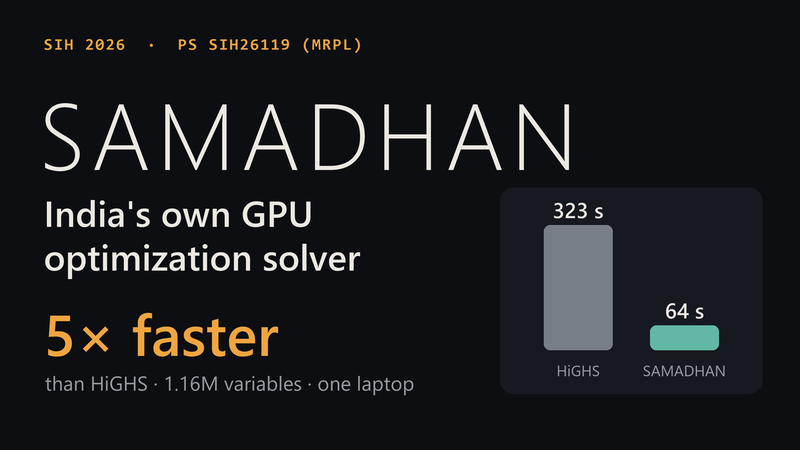
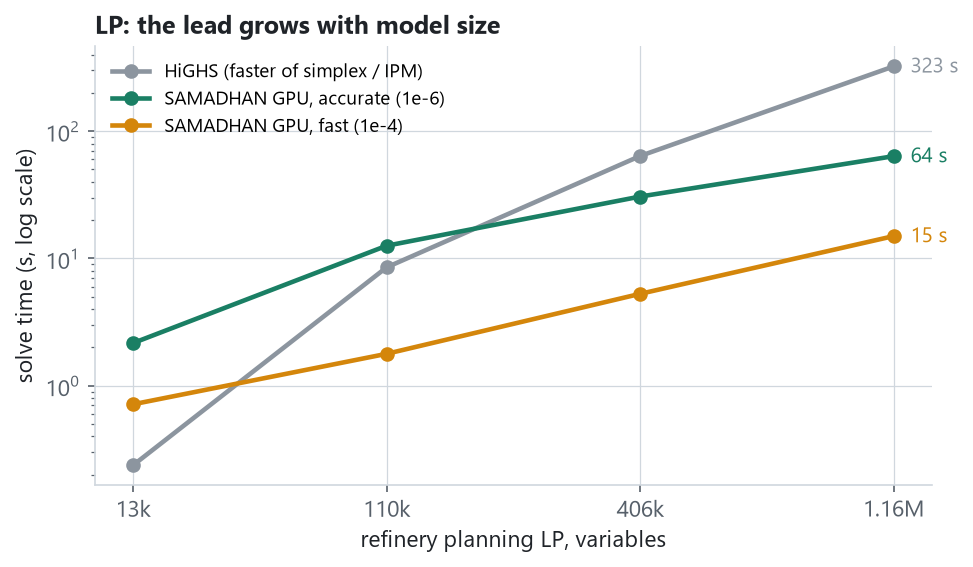
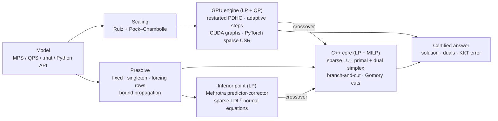
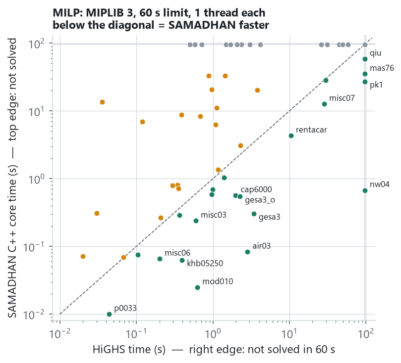
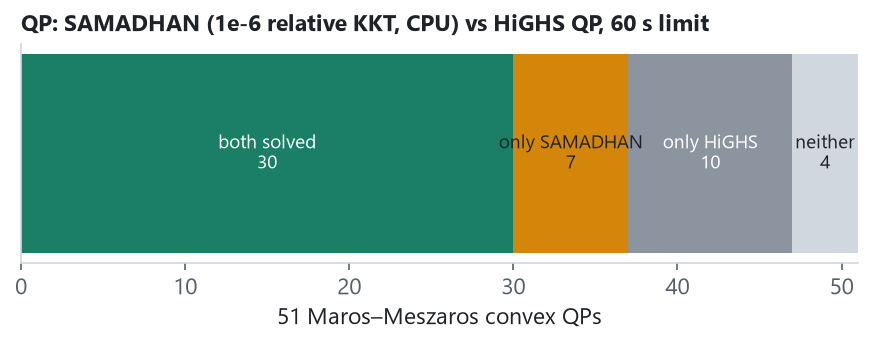

# SAMADHAN — a sovereign optimization solver (LP · QP · MILP), GPU-first

[](https://github.com/NAMAN-THAKUR-1944/SIH2026-SIH26119-SAMADHAN/actions/workflows/tests.yml)
[](LICENSE)


**Smart India Hackathon 2026 · PS SIH26119 (MRPL): *Indigenous GPU-Accelerated Optimization Solver
(Sovereign Alternative to Xpress / CPLEX)* · Team VIGHNAX (127364)**

SAMADHAN (समाधान, "solution") is an optimization solver written from scratch: no CPLEX, Gurobi, Xpress,
HiGHS, CBC or SCIP code inside. It has three engines:

* a **GPU engine for LP and convex QP**: restarted primal-dual hybrid gradient (PDLP / PDQP family), running
  entirely on the GPU with sparse mat-vecs and CUDA graphs;
* a **C++17 core for LP and MILP**: presolve, a sparse LU factorisation, primal and dual simplex (exact vertex
  solutions) and branch-and-cut (reliability branching, node domain propagation, Gomory and c-MIR cuts,
  feasibility pump and diving heuristics);
* an **interior-point method for LP** (Mehrotra predictor-corrector, normal equations factorised by the core's
  sparse LDLᵀ).

**Crossover** joins them: an interior-point or GPU solution is turned into an exact optimal vertex by the
simplex. `samadhan solve` picks the engine from the model: MILPs and LPs up to 50k variables go to the C++
core, larger LPs and all QPs to the GPU engine; `--engine ipm` runs the interior-point method with crossover.

HiGHS, the leading open-source solver, is used only as an outside referee for answers and speed.

▶ **3-minute demo video:** [youtu.be/zagX0zqtIeU](https://youtu.be/zagX0zqtIeU) (a real 1.16 M-variable run, the head-to-head with HiGHS, and all benchmark results)

📄 **Idea deck:** [`docs/SAMADHAN_SIH26119_Idea.pdf`](docs/SAMADHAN_SIH26119_Idea.pdf)

🧪 **Check it yourself in 5 minutes:** [two Docker commands](#evaluate-it-in-5-minutes), nothing else to install

[](https://youtu.be/zagX0zqtIeU)

## Results at a glance

All numbers are measured on one laptop (RTX 5050 Laptop GPU 8 GB), are reproducible with the scripts
below, and are stored in [`results/`](results).

| | What | Result |
|---|---|---|
| **LP** | Refinery planning LP, 1.16 M variables | **5.1× faster** than HiGHS at 1e-6 (cost within 0.0002 %), **22×** at 1e-4 |
| **LP** | Netlib (91 models) | C++ simplex: **91/91 solved** to exact vertices (all within 1e-9 of HiGHS); interior point + crossover: 89/91; GPU engine: 86 to 1e-4; MPS reader identical to HiGHS on 91/91 |
| **MILP** | MIPLIB 3 (all 65 models, 60 s) | **41 proved optimal**, all correct, and a feasible solution on 61; 3 of them HiGHS could not finish (nw04, pk1, qiu); faster than HiGHS on 19; HiGHS proves 50 |
| **MILP** | MIPLIB 2017 (50 benchmark-set models, 60 s) | 4 proved optimal, all correct, and a feasible solution on 33; HiGHS proves 18 and finds a solution on all 50; on 5 models SAMADHAN's solution is the better one |
| **QP** | Maros–Meszaros (129 convex QPs, 60 s) | **79 solved** to 1e-6 relative KKT (HiGHS 99); all 64 solved by both agree; 15 only SAMADHAN solves |
| **QP** | Refinery QP (convex cost curves) | 13k vars: 78× faster than the HiGHS QP solver; from 110k vars HiGHS does not finish in 600 s, SAMADHAN takes 1.5 s |



## Evaluate it in 5 minutes

Only Docker is needed: no Python, CUDA or compiler. Build the image straight from this repository, then run it:

```bash
docker build -t samadhan https://github.com/NAMAN-THAKUR-1944/SIH2026-SIH26119-SAMADHAN.git
docker run --rm samadhan
```

The build takes a few minutes (it downloads PyTorch and compiles the C++ core). The run is a self-check of
every engine: small LP, QP and MILP models are solved, every answer is compared with HiGHS or with an optimum
worked out by hand, and feasibility is recomputed from the returned solution vector instead of trusting the
solver's own report. Real output on a laptop CPU:

```text
SAMADHAN self-check   GPU engine on CPU   referee: HiGHS 1.15.1

     model                      vars  engine             SAMADHAN      reference            obj. err  infeas.    time
---------------------------------------------------------------------------------------------------------------------
LP   textbook (2 vars)             2  GPU engine              -36            -36  by hand    5.6e-10  0.0e+00   0.02s  PASS
LP   textbook (2 vars)             2  C++ core                -36            -36  by hand    0.0e+00  0.0e+00   0.00s  PASS
LP   refinery planning         1,708  GPU engine        87491.313      87491.468  HiGHS      1.8e-06  1.2e-06   1.40s  PASS
LP   refinery planning         1,708  C++ core          87491.468      87491.468  HiGHS      3.3e-16  9.7e-17   0.02s  PASS
LP   textbook (2 vars)             2  IPM+xover               -36            -36  by hand    0.0e+00  0.0e+00   0.01s  PASS
LP   refinery planning         1,708  IPM+xover         87491.468      87491.468  HiGHS      3.3e-16  1.3e-16   0.06s  PASS
QP   HS21, Maros-Meszaros          2  GPU engine           -99.96         -99.96  by hand    0.0e+00  0.0e+00   0.01s  PASS
QP   refinery, convex costs    1,708  GPU engine        113146.25      113146.25  HiGHS      1.9e-08  5.8e-07   0.89s  PASS
MILP textbook knapsack             2  C++ core                -20            -20  by hand    0.0e+00  0.0e+00   0.00s  PASS
MILP refinery contracts #0       146  C++ core           27531.34       27531.34  HiGHS      1.2e-15  1.1e-15   0.01s  PASS
MILP refinery contracts #1       146  C++ core          23781.574      23781.574  HiGHS      1.5e-16  2.5e-13   0.02s  PASS
MILP refinery contracts #2       146  C++ core          44110.416      44110.416  HiGHS      1.6e-16  2.2e-16   0.00s  PASS

12/12 checks passed in 3.6 s.  obj. err = relative distance to the reference;
infeas. = worst constraint, bound or integrality violation, recomputed here from the solution vector.
```

Then try:

| To see | Run |
|---|---|
| Your own model (the engine is picked from the model) | `docker run --rm -v "$PWD:/models" samadhan solve /models/model.mps` |
| A 110k-variable refinery planning LP (about 10 s on a CPU) | `docker run --rm samadhan demo --size M --device cpu` |
| The full test suite | `docker run --rm --entrypoint python samadhan -m pytest -q` |

**On an NVIDIA GPU** (Windows: Docker Desktop with the WSL 2 engine; Linux: the NVIDIA Container Toolkit), build
the CUDA image (it needs about 12 GB of disk) and solve the 1.16 M-variable refinery LP:

```bash
docker build --build-arg TORCH_INDEX=https://download.pytorch.org/whl/cu128 -t samadhan:gpu https://github.com/NAMAN-THAKUR-1944/SIH2026-SIH26119-SAMADHAN.git
docker run --rm --gpus all samadhan:gpu demo --size XL --tol 1e-6
```

On the RTX 5050 laptop this takes 73.7 s inside Docker and 65.5 s natively (the same 1.2 ms per iteration; the
Docker run needed more iterations), against 323 s for HiGHS. `docker run --rm --gpus all samadhan:gpu` runs the
self-check on the GPU, and the full test suite passes in the GPU image.

In Windows PowerShell write `${PWD}` instead of `$PWD`. Every number in this README has its raw data in
[`results/`](results) and the command that produced it under [Reproduce every number](#reproduce-every-number).

## Architecture



## Results in detail

### LP — refinery supply-chain planning (MRPL use case)

Crude purchase, CDU capacity, sulfur blending, yields, dispatch and depot inventory. HiGHS is credited with
the faster of its dual simplex and interior point; SAMADHAN with the faster of its two GPU methods.

| Model | Variables | Nonzeros | HiGHS (best) | SAMADHAN accurate (1e-6) | SAMADHAN fast (1e-4) |
|---|---:|---:|---:|---:|---:|
| S  | 13,296    | 25,416    | 0.24 s | 2.2 s (0.1×)  | 0.7 s (0.3×) |
| M  | 109,536   | 214,092   | 8.5 s  | 12.6 s (0.7×) | 1.8 s (4.8×) |
| L  | 406,080   | 796,512   | 63.9 s | 30.7 s (2.1×) | 5.3 s (12×) |
| XL | 1,157,120 | 2,273,888 | 323 s  | 63.7 s (5.1×) | 15.0 s (22×) |

**Netlib** (91 classic LPs, up to 6,071 rows, one thread, 60 s):

| Engine | Solved | Accuracy | Time |
|---|---:|---|---|
| C++ dual simplex (presolve, sparse LU) | **91 / 91** | exact vertices, all within 1e-9 of the HiGHS optimum (worst 2e-10) | median 0.012 s (HiGHS 0.008 s), 29 s for all 91, faster than HiGHS on 9 |
| Interior point + crossover | 89 / 91 | exact vertices, all within 1e-9 (worst 1e-10) | median 21 iterations, 0.12 s; dfl001 and fit2p time out at 120 s (dense normal equations) |
| GPU engine, CPU mode, 1e-4 KKT | 86 / 91 | 80 within 0.1 % | median 1.7 s |

The simplex and the interior-point method also solve the five models the first-order engine cannot (bnl1,
greenbea, greenbeb, perold, pilot4): these ill-conditioned LPs are exactly where second-order and vertex
methods are needed. The hardest, pilot87, now lands within 1.4e-12 of the optimum (simplex) and 9e-15
(interior point + crossover), thanks to scaling and a final pass at 100× tighter tolerances.

### LP — exact vertices from the GPU engine (crossover)

Crossover turns the GPU engine's 1e-4 solution into an exact optimal vertex; every result below equals the
cold-start simplex optimum to 5e-15. Now that presolve and refactorisation make the cold-start simplex faster,
crossover wins on 4 of the 11 models (fit2p 28×, refinery S 3.7×, 25fv47, 80bau3b) and is slower on the rest,
including the 100k+ refinery models, where the crash basis from a 1e-4 point needs too many pivots (on L, HiGHS's
interior point takes 64 s). On pilot and greenbea the GPU engine stopped at its time limit short of 1e-4;
crossover still finished exactly from that point:

| Model | Variables | Cold simplex | GPU engine (1e-4) | then crossover | Crossover vs cold |
|---|---:|---:|---:|---:|---:|
| refinery-S | 13,296 | 0.71 s | 1.85 s | 0.19 s | **3.7× faster** |
| refinery-M | 109,536 | 56 s | 3.27 s | 166 s | 3.0× slower |
| refinery-L | 406,080 | 672 s | 6.03 s | 1292 s | 1.9× slower |
| 25fv47 | 1,571 | 0.15 s | 3.60 s | 0.09 s | **1.7× faster** |
| 80bau3b | 9,799 | 0.42 s | 10 s | 0.32 s | **1.3× faster** |
| d2q06c | 5,167 | 1.05 s | 18 s | 2.55 s | 2.4× slower |
| degen3 | 1,818 | 0.30 s | 3.48 s | 0.32 s | even |
| fit2p | 13,525 | 1.99 s | 3.62 s | 0.07 s | **28.6× faster** |
| maros-r7 | 9,408 | 0.64 s | 0.62 s | 4.22 s | 6.6× slower |
| pilot | 3,652 | 1.02 s | 77 s | 2.14 s | 2.1× slower |
| greenbea | 5,405 | 0.44 s | 300 s | 1.52 s | 3.4× slower |

### MILP — MIPLIB 3



All 65 MIPLIB 3 models (up to 6,805 rows), 60 s each, one thread each, relative gap 1e-4. **SAMADHAN proves
41 optimal**, every one matching the known optimum, and finds a feasible solution on **61 of 65**; HiGHS proves 50.
SAMADHAN finishes **nw04 (87,482 columns), pk1 and qiu** where HiGHS runs out of time, and is faster than HiGHS on
19 models, for example air03 (0.1 s vs 2.8 s), gesa3 (0.9 s vs 3.4 s), cap6000 (0.5 s vs 2.0 s), mod008 (0.2 s vs
1.2 s), rentacar (3.7 s vs 10.4 s) and misc07 (17 s vs 28 s).

How it got here, each step measured on the same models:

| Version | Models run | Proved optimal | With a feasible solution | Shifted geo-mean time |
|---|---:|---:|---:|---:|
| Dense basis inverse (first prototype) | 58 | 26 | — | — |
| Sparse LU, scaling, presolve | 65 | 40 | 56 | 17.7 s |
| + primal heuristics, reliability branching, node propagation, c-MIR cuts | 65 | 40 | 61 | 16.8 s |
| + stronger presolve (dual fixing, free column singletons), faster refactorisation | 65 | 41 | 61 | 16.0 s |

The branch-and-cut work finds the first feasible solutions on 10teams, fixnet6, harp2, mkc, p2756 and set1ch,
newly proves 10teams, pp08a and pp08aCUTS, and cuts solve times sharply on many models (gesa2 21 s → 0.9 s, vpm1
14 s → 0.01 s, qnet1 33 s → 19 s, p0548 6.9 s → 2.9 s). The aggregated c-MIR cuts close most of the root gap on
fixed-charge models (pp08a: 17 % of the gap left without them, 3 % with them; set1ch 27 % → 9 %; gesa2 56 % → 25 %).
Two models solved in the first version now stop just short within 60 s (bell5, mas76: incumbent optimal or within
0.006 %, bound not yet closed), and a few results move by tens of percent between runs because heuristic budgets
are time-based (modglob, l152lav). The features were chosen by an ablation over all 65 models; knapsack cover cuts
made things slower on average and are off by default.

**MIPLIB 2017** (50 models of the current benchmark set, 60 s, one thread, gap 1e-4) is much harder, and here
HiGHS is clearly ahead: it proves **18** optimal and finds a solution on all 50; SAMADHAN proves **4** (markshare_4_0,
nw04, pk1, swath1, all correct; nw04, pk1 and markshare_4_0 are not proved by HiGHS in 60 s; neos8 is proved in
some runs at about 45 s) and finds a solution on 33. On 5 models SAMADHAN ends with the better solution (gen-ip054,
mas74, mas76, pk1, rmatr100-p10). The
gap has two measured causes: presolve (on ex9 HiGHS's presolve removes the whole model, ours only 17 % of the rows)
and simplex speed on large LPs (ex9's relaxation: HiGHS 12 s, ours more than 120 s). Running this set also found
two bugs that are now fixed: integer columns without any bound in the MPS file must be binary (MIPLIB and HiGHS
convention), and a cut round whose LP could not be re-solved in time is now rolled back instead of ending the
solve.

### QP — Maros–Meszaros and refinery QP



The same GPU engine solves convex QPs (`0.5 x'Qx + c'x`) by adding the gradient `Qx` to the primal step.
**Maros–Meszaros** (129 convex QPs, CPU mode, 60 s, one thread each): SAMADHAN solves **79** to 1e-6
relative KKT and the HiGHS QP solver 99. All **64** solved by both agree to 1e-4. SAMADHAN solves **15** that
HiGHS does not (HiGHS reports a solve error, no status or a time-out, e.g. AUG2D, LASER, MOSARQP1, QSCTAP3),
and HiGHS crashes on STADAT1. HiGHS solves 35 that SAMADHAN does not finish in 60 s: ill-conditioned problems
where a first-order method needs many more iterations or a crossover step.

**Refinery QP** (every activity has a convex cost curve: crude supply, processing, freight congestion,
holding and shortage), GPU, 1e-6 relative KKT. HiGHS's QP solver is an active-set method:

| Model | Variables | HiGHS QP | SAMADHAN GPU (1e-6) | Cost check |
|---|---:|---:|---:|---|
| S | 13,296 | 86.3 s | 1.1 s (78×) | 0.00016 % from HiGHS |
| M | 109,536 | > 600 s (not solved) | 1.5 s (> 402×) | certified by KKT (1e-6) |
| L | 406,080 | > 1660 s (not solved) | 5.1 s (> 323×) | certified by KKT (1e-6) |
| XL | 1,157,120 | not attempted ¹ | 19.9 s (—) | certified by KKT (1e-6) |

¹ HiGHS was given 600 s per model; on L it stopped only after 1,660 s without a solution, so XL was not attempted.

## Honest limitations

* On small LPs HiGHS's simplex is still a little faster than ours (Netlib median 0.008 s against 0.012 s,
  part of it Python-side presolve); the GPU engine pays off from roughly 100k variables.
* The GPU engine reaches 1e-4…1e-6 relative accuracy. Crossover turns its solution into an exact vertex, but it
  beats a cold-start simplex on only 4 of 11 test models (fit2p 28×, refinery S 3.7×) and is slower on the 100k+
  refinery models (M: 166 s against 56 s; L: 1,292 s against 672 s, where HiGHS's interior point takes 64 s).
  Exact vertices at a million variables need a primal-dual push crossover (roadmap).
* The interior-point method factorises A Θ Aᵀ directly: models with dense columns (fit2p) are slow, as there is
  no dense-column splitting yet.
* Presolve covers the standard primal reductions but not yet dual reductions, doubleton substitution or
  coefficient strengthening. The branch-and-cut root bound is still weaker than HiGHS's on some models (no lifted
  cover or multi-row flow-cover cuts, no probing: p2756, fixnet6), and strong branching costs time on models with
  very cheap LPs (misc07). One thread.

## Install without Docker

```bash
python -m venv .venv
.venv/Scripts/pip install torch --index-url https://download.pytorch.org/whl/cu128   # or /whl/cpu
.venv/Scripts/pip install -r requirements.txt
.venv/Scripts/python -m samadhan verify                         # self-check of every engine, ~10 s
.venv/Scripts/python -m pytest                                  # 44 correctness tests, ~25 s
.venv/Scripts/python -m samadhan demo --size XL --tol 1e-6      # 1.16M-variable refinery LP on the GPU
.venv/Scripts/python -m samadhan solve model.mps                # engine picked from the model
.venv/Scripts/python -m samadhan solve model.mps --engine core  # force the C++ dual simplex / branch-and-cut
.venv/Scripts/python -m samadhan solve model.mps --engine ipm   # interior point + crossover to a vertex
```

```python
from samadhan import read_mps, solve, solve_core, solve_ipm

lp = read_mps("model.mps")
print(solve(lp, device="cuda", tol=1e-6).primal_obj)        # GPU engine: LP, or QP when lp.Q is set
print(solve(lp, tol=1e-4, crossover=True).primal_obj)       # GPU engine + crossover: exact vertex (LP)
print(solve_ipm(lp, crossover=True).primal_obj)             # interior point + crossover (LP)
print(solve_core(lp, time_limit=60).obj)                    # C++ core: LP or MILP (integer markers in the file)
```

The C++ core is compiled automatically on first use with the zig toolchain (installed from PyPI with the
requirements), so no system compiler is needed. CI lints the code, builds the core and runs the tests on
Ubuntu and Windows for every push, and builds the Docker image and runs the self-check inside it.

## Reproduce every number

Run from the repository root; each script writes the raw results used in this README.

```bash
python -m benchmarks.lp                  # refinery LP table              -> results/lp_refinery.json
python -m benchmarks.milp                # refinery MILPs, both engines   -> results/milp_refinery.json
git clone https://github.com/coin-or-tools/Data-Netlib  data/netlib
python -m benchmarks.netlib              # Netlib LPs, GPU engine         -> results/lp_netlib.json
python -m benchmarks.netlib --engine core   # Netlib LPs, C++ simplex     -> results/lp_netlib_core.json
python -m benchmarks.netlib --engine ipm    # Netlib LPs, IPM + crossover -> results/lp_netlib_ipm.json
python -m benchmarks.crossover --with-L     # cold simplex vs crossover    -> results/lp_crossover.json
git clone https://github.com/coin-or-tools/Data-miplib3 data/miplib3
python -m benchmarks.miplib              # MIPLIB 3                       -> results/milp_miplib3.json
python -m benchmarks.miplib --set miplib2017   # 50 MIPLIB 2017 models     -> results/milp_miplib2017.json
# (the .mps.gz files of the models listed in benchmarks/miplib.py, from miplib.zib.de/WebData/instances/)
# Maros-Meszaros .mat files (< 300 KB) from github.com/qpsolvers/maros_meszaros_qpbenchmark -> data/maros/
python -m benchmarks.qp maros            # Maros-Meszaros QPs             -> results/qp_maros.json
python -m benchmarks.qp refinery --time-limit 600   # refinery QP (GPU)  -> results/qp_refinery.json
python docs/make_figures.py              # the figures above
```

## Project layout

```
samadhan/            the solver package
  pdlp.py            GPU engine for LP and QP (restarted PDHG, adaptive and CUDA-graph modes)
  core.py            binding for the C++ core; compiles it with zig on first use
  mps.py, qpdata.py  model readers: MPS (free / fixed format, RANGES, integer markers), Maros-Meszaros .mat
  simplex.py, milp.py  pure-Python reference simplex and branch-and-bound, used to cross-check the C++ core
  presolve.py        presolve and postsolve for the C++ core (LP and MILP)
  ipm.py             interior-point method (Mehrotra) with crossover
  generate.py        refinery planning LP / QP / MILP generators
  baseline.py        HiGHS referee (LP, QP, MILP), used only for benchmarks and tests
  verify.py          self-check: python -m samadhan verify
  __main__.py        command line: python -m samadhan
cpp/samadhan_core.cpp  C++17 dual simplex and branch-and-cut (C ABI)
Dockerfile           CPU image by default; CUDA image with --build-arg TORCH_INDEX=.../whl/cu128
benchmarks/          one script per benchmark; results/ holds their raw JSON output
tests/               pytest suite: every component checked against HiGHS or a hand-computed optimum
docs/                idea deck (PDF), figures and the script that draws them
```

## How it works

* **LP / QP (GPU).** Restarted PDHG (Applegate et al., NeurIPS 2021; Lu & Yang, cuPDLP 2023) with Ruiz and
  Pock–Chambolle scaling, adaptive step sizes, primal-weight updates and KKT-based restarts. A constant-step
  variant has no host synchronisation between checks, so 64 iterations are captured once as a CUDA graph and
  replayed with one launch. For QP the primal step uses `Qx + c − Kᵀy` with `τ ≤ 1/(‖Q‖/2 + σ‖K‖²)`
  (linearised PDHG, as in PDQP) and the Wolfe dual for the gap.
* **Interior point.** Mehrotra predictor-corrector on the standard form `Ax = b, 0 ≤ x ≤ u` (free columns
  kept, with a small primal regularisation), after Ruiz scaling. Each iteration forms `A Θ Aᵀ`, scales it to a
  unit diagonal and factorises it once with the C++ sparse LU in symmetric mode (diagonal pivots in
  minimum-degree order, i.e. LDLᵀ), then solves twice with iterative refinement.
* **Crossover.** From an interior or GPU point: crash basis (columns strictly inside their bounds become
  basic), dual simplex on randomly perturbed shifted costs until primal feasible, original costs restored
  exactly, primal simplex clean-up, and a final pass at 100× tighter tolerances. If it is slower than a cold
  start it hands over to one, so the answer is always an exact vertex.
* **Presolve.** Before the C++ core runs, the model is reduced until a pass changes nothing: fixed and empty
  columns are removed, singleton rows become bounds, rows that their activity bounds already satisfy are
  dropped, forcing rows fix their columns, integer columns get tighter bounds from the rows (domain
  propagation), columns that neither their cost nor any row pushes upwards are fixed at a bound (dual fixing),
  and continuous columns that sit in a single equality row which already implies their bounds are substituted out
  (free column singletons, recovered in postsolve). The solution is mapped back to the original columns and checked against the original rows.
* **LP / MILP (C++).** Every row gets a logical variable, so the simplex works on `[A −I]` with column
  bounds, after geometric-mean scaling and equilibration (powers of two). The basis is held as a sparse LU
  factorisation: Markowitz pivot order with threshold pivoting, product-form eta updates between
  refactorisations, and repair of singular bases with logical columns. Bounded dual simplex with dual
  steepest-edge pricing (Forrest–Goldfarb weight updates), a Harris ratio test and row-wise pricing when the
  pivot row is sparse. Branch-and-bound dives from each node keep the factorisation (a bound change on a basic
  variable keeps the basis dual feasible); other nodes store a 2-bit-per-column basis for a warm restart.
  Root cuts: Gomory mixed-integer cuts from the tableau and aggregated c-MIR cuts (Marchand & Wolsey: up to six
  rows combined to eliminate continuous columns, variable upper bounds x ≤ u·y substituted, the best of several
  scalings rounded); knapsack cover cuts are available, off by default. Primal heuristics:
  rounding, a feasibility pump (objective variant, with cycle flips and perturbation) at the root, and
  fractional / guided diving at the root and periodically in the tree, all within 10 % of the time limit; with
  an incumbent, reduced-cost fixing tightens the global bounds. Reliability branching seeds pseudocosts by
  strong branching (25 dual simplex iterations per child, at most half of all LP work), and every node runs
  activity-based domain propagation that prunes infeasible nodes before their LP. Each feature can be switched
  off (`solve_core(..., features=)`); the defaults were chosen by an ablation over MIPLIB 3.

## Roadmap (SIH build phase)

1. Primal-dual push crossover for million-variable GPU solutions; dense columns in the interior-point
   method; dual presolve reductions.
2. Stronger presolve (doubleton and implied-free substitution, dominated and duplicate columns, probing) and
   a Forrest–Tomlin basis update for large LPs, the two measured gaps on MIPLIB 2017; lifted cover and
   flow-cover cuts; parallel tree search.
3. GPU LP relaxations inside branch-and-bound for very large MILPs; MIQP.
4. Native CUDA kernels for the PDHG loop; REST service for plant planning systems.

## Team and license

Team VIGHNAX (127364), SRM University, for Smart India Hackathon 2026. Licensed under [Apache-2.0](LICENSE).
